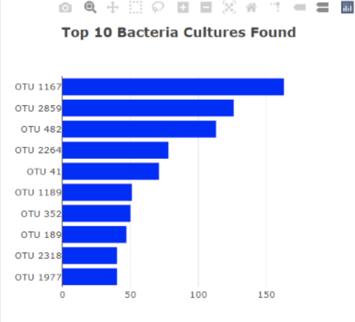
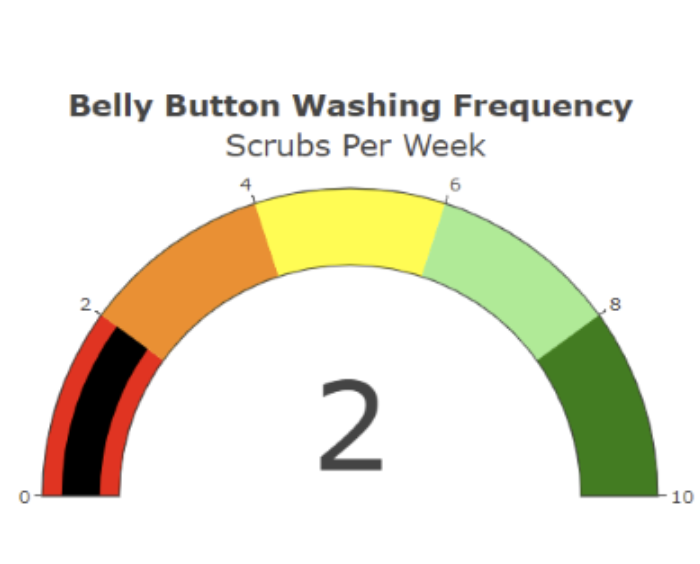
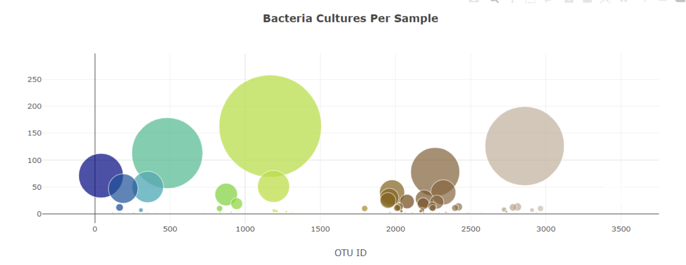
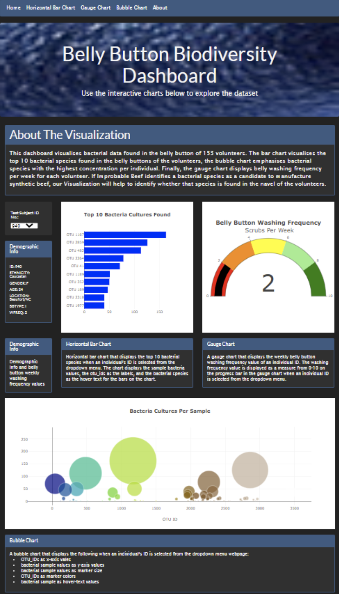
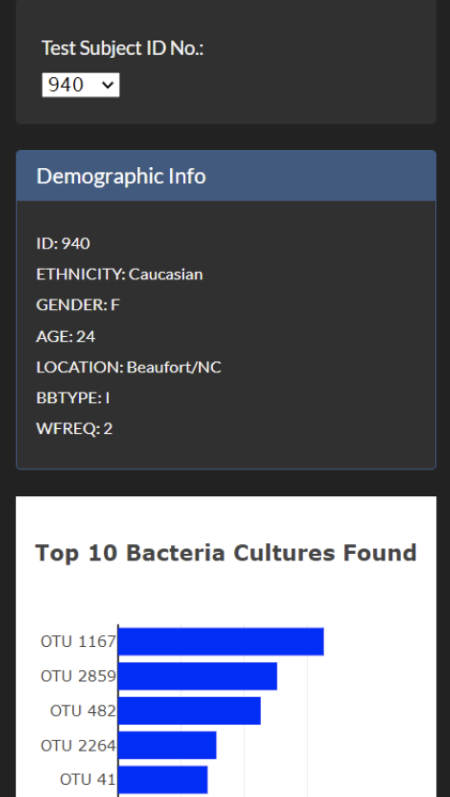

# Belly-Button-Biodiversity-Dashboard
## Overview
The goal of this project is to visualize belly button microbial data. To identify a viable bacteria species that can synthesize a protein that tastes like beef. A food startup company, Improbable Beef, has decided to gather data from volunteers and determine whether their belly button could be the potential source of bacteria species that can synthesize protein to make beef alternatives. 

Improbable beef has gathered demographic and belly button data from 153 volunteers. Since bacteria in the same location in the human body may vary, we will use this data to create Visualization that will help quickly identify people that may have bacteria that can be used to synthesize beef. At the end of the analysis, we will produce three Visualizations:
- a bar chart that visualizes the top 10 bacterial species found in the volunteers' belly buttons
- a bubble chart that emphasizes bacterial species with the highest concentration per individual
- a gauge chart that displays belly washing frequency per week for each volunteer. 

Suppose Improbable Beef identifies a bacterial species as a candidate to manufacture synthetic beef; in that case, our Visualization will help to determine whether that species is found in the navel of any one of the volunteers.

### Control Flow
1.  Create a folder structure to hold the index.html file, and the JavaScript files
2.  create a basic HTML page to view the belly button JSON data
3.  Load and inspect the belly button JSON data using the JavaScript, and Web browser's console log
4.  Create an event listener to check for changes in the volunteer ID
5.  The HTML page will have the following layout
      - The HTML page will hold a dropdown panel for the volunteer ID and their corresponding demographic data
      - two columns that will hold a horizontal bar chart and a gauge chart
      - a row to dsiplay a bubble chart
6.  Create a JavaScript to read the JSON data     
      - The JavaScript will contain a function that creates a horizontal bar chart to display the top 10 bacterial species (OTUs) when an individual’s ID is selected from the dropdown menu on the webpage. The horizontal bar chart will display the sample_values as the values, the otu_ids as the labels, and the otu_labels as the hover text for the bars on the chart.
      - Another block of code in the function will create a bubble chart that will display the following when an individual’s ID is selected from the dropdown menu webpage:
            - The otu_ids as the x-axis values.
            - The sample_values as the y-axis values.
            - The sample_values as the marker size.
            - The otu_ids as the marker colors.
            - The otu_labels as the hover-text values. 
7.  The final part of the function will a gauge chart that displays the weekly washing frequency's value, and display the value as a measure from 0-10 on the progress bar in the gauge chart when an individual ID is selected from the dropdown menu.

### Results
The HTML page is customized with the following features:
1. An image is added to the jumbotron
2. A custom bootswatch theme was used to complement Boostrap 3.3.7
3. A paragraph summarsing the visualizations was added.
4. A navigation bar was added to select the different visualizations
5. Brief information is added under each visualization for added context
6. All column DIVs add up to 12 and utilized the responsive feature of plotly charts to make the page mobile responsive

Horizontal Bar Chart: Top 10 Bacteria Cultures Found and Gauge Chart: Showing Belly Button Washing Frequency

Bubble Chart

Belly_Button_Biodiversity_Dashboard Web and Mobile Responsive

